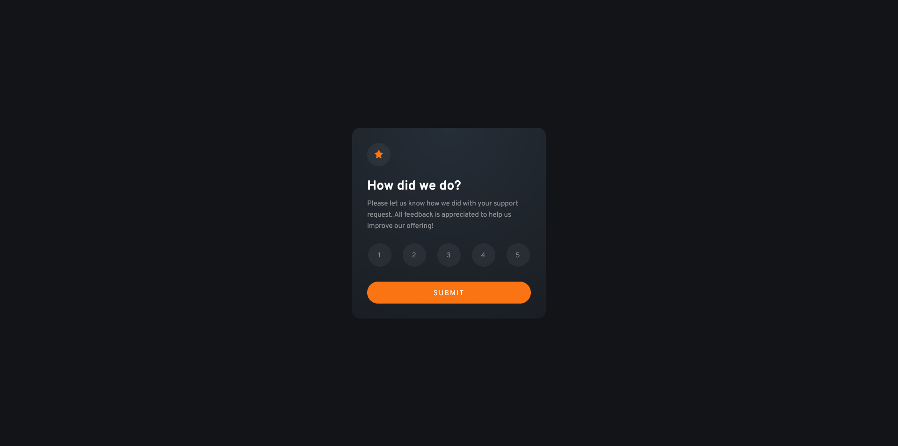

# Frontend Mentor - Interactive rating component solution

This is a solution to the [Interactive rating component challenge on Frontend Mentor](https://www.frontendmentor.io/challenges/interactive-rating-component-koxpeBUmI). Frontend Mentor challenges help you improve your coding skills by building realistic projects. 

## Table of contents

- [Overview](#overview)
  - [The challenge](#the-challenge)
  - [Screenshot](#screenshot)
  - [Links](#links)
- [My process](#my-process)
  - [Built with](#built-with)
  - [What I learned](#what-i-learned)
  - [Continued development](#continued-development)
  - [Useful resources](#useful-resources)
- [Author](#author)

## Overview

### The challenge

Users should be able to:

- View the optimal layout for the app depending on their device's screen size
- See hover states for all interactive elements on the page
- Select and submit a number rating
- See the "Thank you" card state after submitting a rating

### Screenshot



### Links

- Solution URL: [Add solution URL here](https://your-solution-url.com)
- Live Site URL: https://joaocardosodev.github.io/Interactive-rating-component/

## My process

### Built with

-HTML
-CSS
-JavaScript

### What I learned


I used this project as a way to practice some JS, the solution I used to keep the focus on the buttons is far from optimized but it allowed me to use more JS. The part of the code in question is this one:

```js
function resetBtn(list){
    list.forEach(element => {
        if (element.classList.contains('activeBtn'));
            element.classList.remove('activeBtn');
            element.classList.add('secButton'); 
    });
function checked(button) {
    button.classList.remove('secButton')
    button.classList.add('activeBtn')
};
```

I used this function to reset the class on the div I was clicking so that it would change to the correct status. I could've done this more easily with :focus on the CSS document.

The section that made me doubt my solution the most was this:

```js
function thankYou(res) {
    let img = document.querySelector("img");
    let text = document.querySelector("p");
    let title = document.querySelector("h1");
    let resultTY = document.getElementsByTagName("span")[0];
    let imgDiv = document.getElementsByClassName("star")[0];
    let numbers = document.getElementsByClassName("numbers")[0];
    let submit = document.getElementsByClassName("submit")[0];
    numbers.style.display = "none"
    submit.style.display = "none"

    resultTY.classList.add("resultTY")
    imgDiv.classList.replace("star", "thankYouImg");
    img.classList.replace("imgStar", "imgTY");
    text.style.textAlign = "center"
    text.style.margin = "4px"
    title.style.display = "flex"
    title.style.justifyContent = "center"
    resultTY.innerText = `You selected ${res} out of 5`
    img.src = "images/illustration-thank-you.svg";
    text.innerText = "We appreciate you taking the time to give a rating. If you ever need more support, don’t hesitate to get in touch!";
    title.innerText = "Thank you!";
}
```

I used the thankYou() function to change the slate. Probably there is a much simpler solution, the one I arrived to seems a bit convoluted.

### Continued development

I'd like to keep working on my Javascript proficiency with real use cases and get much more confortable manipulating HTML/CSS.

### Useful resources

- https://developer.mozilla.org/en-US/docs/Web - Used MDN as my main documentation source for the project.
- ChatGPT 3.5 - Whenever I got stuck and couldn't figure out through the documentation itself I used ChatGPT to help me out, tried not to get direct solutions as I think that is detrimental at this stage.

## Author

- LinkedIn - https://www.linkedin.com/in/joao-cardoso-dev/
- Frontend Mentor - https://www.frontendmentor.io/profile/JoaoCardosoDev
